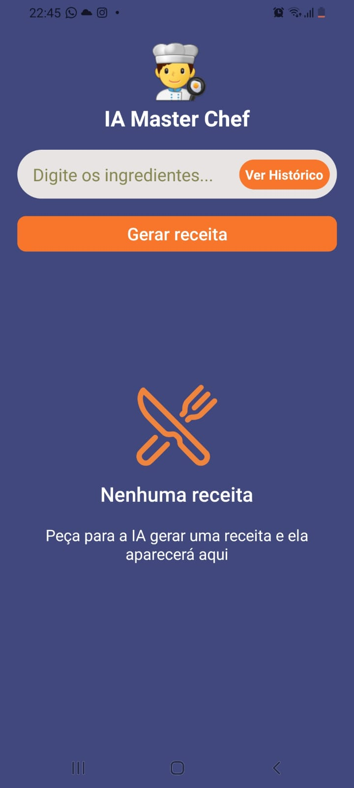
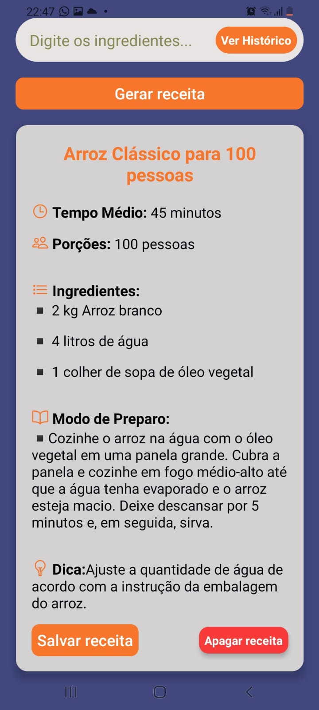
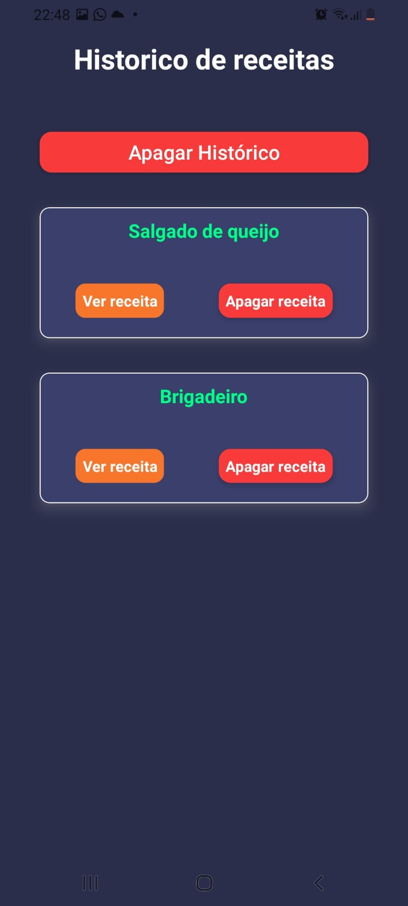

# IA-MasterChef
🍳 App de Receitas com IA

Aplicação mobile que gera receitas personalizadas com inteligência artificial a partir dos ingredientes informados pelo usuário.

📖 Sobre o projeto
Este aplicativo permite que o usuário digite os ingredientes disponíveis e, com o uso de IA, receba uma receita completa incluindo:

⏱ Tempo de preparo
🍽 Porções
🧾 Lista de ingredientes
👨‍🍳 Modo de preparo
💡 Dica adicional

Além disso, o usuário pode salvar receitas no histórico para acessar posteriormente.
A proposta é facilitar o dia a dia na cozinha, evitando desperdícios e ajudando na criatividade culinária.

🚀 Tecnologias utilizadas
React Native
JavaScript
StyleSheet
Axios
React Navigation
API de IA (Groq)
Outras bibliotecas auxiliares

⚙️ Como rodar o projeto
yarn start

📂 Estrutura de pastas
src/
 ├── components
 ├── hooks
 ├── routes
 ├── screens
 ├── services
 └── styles
 
🔐 Variáveis de ambiente
Crie um arquivo .env na raiz do projeto com a seguinte variável:

EXPO_PUBLIC_GROQ_API_KEY=sua_chave_aqui

🧪 Funcionalidades
Geração de receitas com IA
Entrada personalizada de ingredientes
Exibição estruturada da receita
Interface mobile intuitiva
Salvamento de receitas no histórico

📌 Observações
Este projeto foi desenvolvido com foco em aprendizado e prática de integração com APIs de inteligência artificial em aplicações mobile.

👨‍💻 Autor

Desenvolvido por Bruno Correia 🚀

## 📸 Screenshots

  
  
  

